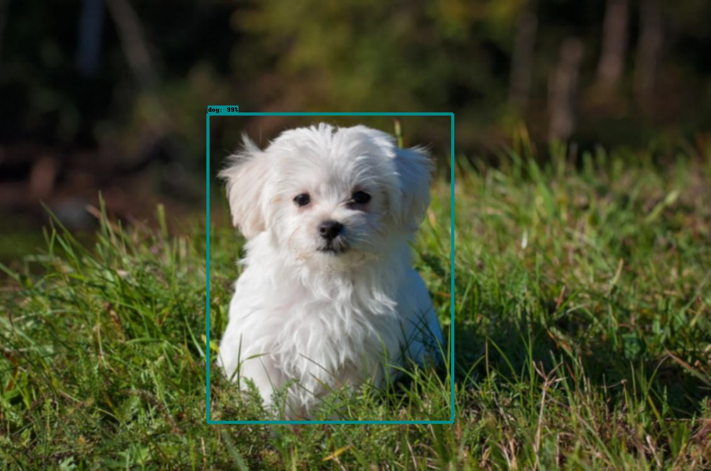

This git repository IS NOT the full code for Jade, and does not include pre-trained models and any equations/conepts and/or training scripts used to train 
Jade. The code included is ONLY the running code for Jade, and should be used for educational purposes only. It does not include any scripts/code written in R or any custom dependencies.

Add Jade at https://discordbots.org/bot/410253782828449802

# JadeV4 Usage
--------
Jade's Prefix is `JD`, and is used to trigger all possible commands through NLP.
Prefix is not required in DMs.

## Example syntax:
--------

### Contextual Generative Conversation
Query:
```
Hi!
How old are you?
```
Response:
```
Hi, I don't know you!
I am 9 years old.
```
Jade can do basic math, with spaces as delimiters. Some basic hardcoded functions also exist.

####
--------

### Neural Style
Query:
```
Can you style this using un? [Attach Image]
Use exp to style [Image Link]
```
*[Attach Image] and [Image Link] would reference [This image](https://github.com/JEF1056/JadeAI/blob/master/EXAMPLE/style_ex.jpg) in this demo.*
<br>
<br>
Response:
<br>
</a>
</a>
<br>
Jade can extract style types (flags) such as `exp` and `un` and links from within the command phrase.

#### Style types (Flags)
<details><summary>EXPAND</summary>
<p>
  
Listed below are flags, in the format `FLAG ||| NAME OF STYLE IMAGE`. Left images are the original, Right images are styled by Jade.
<br>
<br>
```un ||| Udnie ```
<br>
</a>
</a>
<br>
```dk ||| Dark Paint```
<br>
</a>
</a>
<br>
```en ||| Enviornment```
<br>
</a>
</a>
<br>
```rd||| Red```
<br>
</a>
</a>
<br>
```lm ||| La Muse```
<br>
</a>
</a>
<br>
```rp ||| Rainbow Princess```
<br>
</a>
</a>
<br>
```sc ||| The Scream```
<br>
</a>
</a>
<br>
```wr ||| Wreck (George Washington)```
<br>
</a>
</a>
<br>
```wv ||| Wave```
<br>
</a>
</a>
<br>
```ha ||| My artist's art ^-^```
```Works best with images that have a "focus"```
<br>
</a>
</a>
<br>

```exp ||| Experimental```
```WARNING: Most models in this folder are really... uh... weird```
<br>
</a>
</a>
<br>

</p>
</details>

####
--------

### Object Recognition
Query:
```
What objects are in this image? [Attach Image]
Can you find the dog in this picture? [Image Link]
```
*[Attach Image] would reference [This image](https://github.com/JEF1056/JadeAI/blob/master/EXAMPLE/obj_ex_d.jpg) in this demo.*
<br>
*[Image Link] would reference [This image](https://github.com/JEF1056/JadeAI/blob/master/EXAMPLE/obj_ex_fd.jpg) in this demo.*
<br>
<br>
Response:
<br>
</a>
</a>
<br>

####
--------

### Optical Character Recognition
Query:
```
What text is in this image? [Attach Image]
Could read this for me? [Image Link]
```
*[Attach Image] and [Image Link] would reference [This image](EXAMPLE/ocr_ex.png) in this demo.*
<br>
<br>
Response:
<br>
```
Use JD to talk to Jadel Jade is a Tensorflow-driven Al, that,
learns as a conversation progresses using
Reenforcement learning!
```
<br>
Note: Spelling issues are directly copied from output.

####
--------
